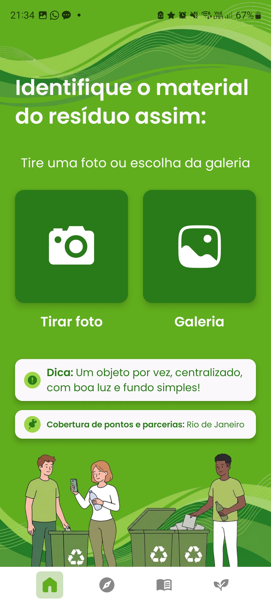
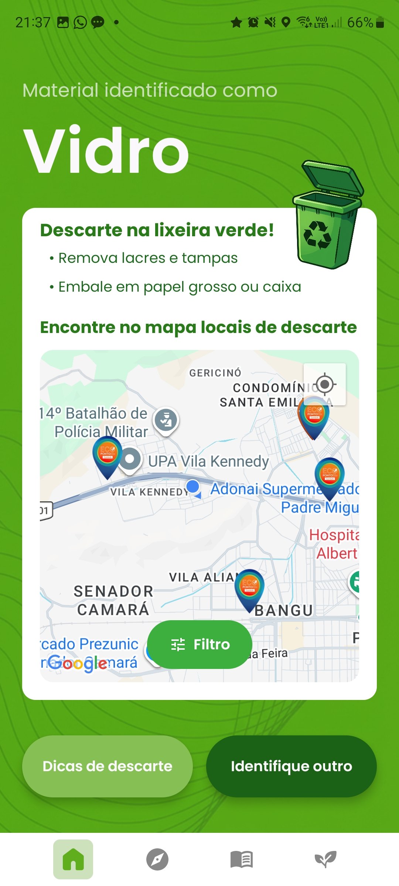
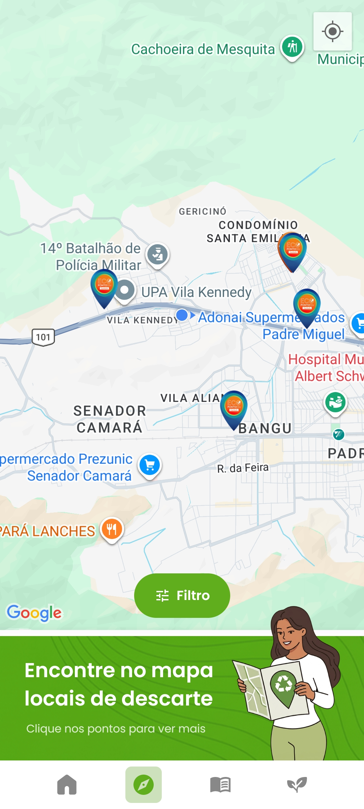
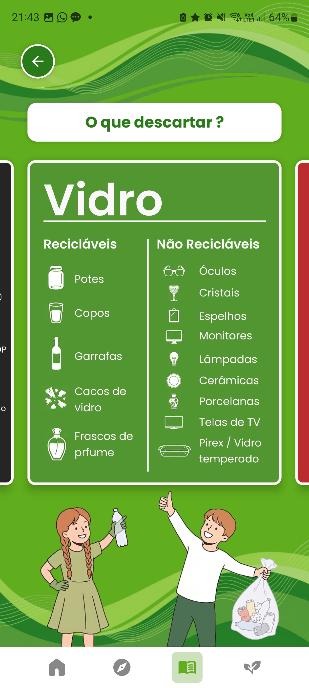
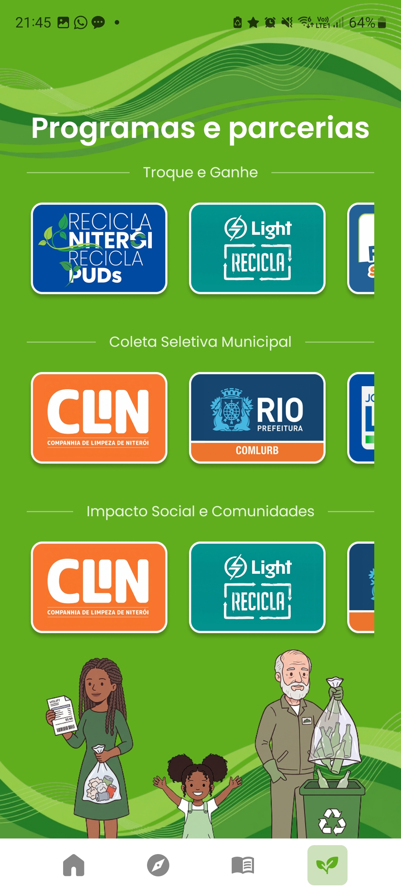

# ♻️ RecycleApp

> Aplicativo Android que usa **rede neural (TensorFlow Lite)** para identificar o tipo de resíduo a partir de uma foto e orientar o descarte correto do material.

> Os scripts de **treinamento, avaliação e conversão do modelo de IA** estão em um repositório separado:
>
> 👉 [Repositório da Rede Neural](https://github.com/J4g3rWulf/ra-cnn-training)

> Este projeto foi desenvolvido como TCC do curso de Ciência da Computação — Universidade Veiga de Almeida, e segue em evolução voluntária após a entrega.

---

## 📦 Download do APK

Para instalar diretamente no celular, sem precisar abrir o projeto no Android Studio:

👉 [Download do APK (Release v2.0.0)](https://github.com/J4g3rWulf/ra-mobile-app/releases/latest)

Baixe o arquivo `app-release.apk` da última release e instale no dispositivo Android.

---

## 📸 Demonstração

<table>
  <tr>
    <td align="center"><br/><sub>Identifique o material</sub></td>
    <td align="center"><br/><sub>Resultado da classificação</sub></td>
    <td align="center"><br/><sub>Mapa de pontos de coleta</sub></td>
  </tr>
  <tr>
    <td align="center"><br/><sub>O que descartar</sub></td>
    <td align="center"><br/><sub>Programas e parcerias</sub></td>
    <td></td>
  </tr>
</table>

### 🎬 Vídeo de demonstração

[](https://youtu.be/BESSs0dSrfA)

---

## 📈 Evolução do projeto

### Fase 1 — TCC

O app foi entregue com foco no fluxo central de classificação de resíduos: captura de foto, análise por rede neural e exibição do resultado. O modelo utilizado era uma CNN customizada com **74% de F1-score**, integrada via TensorFlow Lite.

### Fase 2 — Pós-TCC

Após a entrega e aprovação do TCC, o projeto foi expandido voluntariamente em duas frentes:

**App Android:**

- Navegação por abas com `BottomNavBar` customizada (Home, Mapa, Aprender, Programas)
- Tela de mapa interativo com **153 pontos de coleta reais** da região metropolitana do Rio de Janeiro, carregados via **Cloud Firestore** com fallback offline
- Seção educativa completa (cores das lixeiras CONAMA, o que descartar, como descartar, termos e definições)
- Tela de programas de reciclagem municipais (Recicla Niterói, Light Recicla, EcoCLIN, etc.)
- Arquitetura Clean Architecture + Service Locator

**Modelo de IA:**

- Migração da CNN customizada para **EfficientNetV2B0 com transfer learning**
- **96% de F1-score** no conjunto de teste (era 74% no TCC)
- `CONFIDENCE_THRESHOLD` ajustado de 40% para 65%

| Versão  | Modelo                                            | F1-score | Funcionalidades               |
| ------- | ------------------------------------------------- | -------- | ----------------------------- |
| TCC     | CNN customizada (`model_v03.tflite`)              | 74%      | Classificação + resultado     |
| Pós-TCC | EfficientNetV2B0 (`model_efficientnet_v2.tflite`) | **96%**  | + Mapa + Aprender + Programas |

---

## 📱 Visão geral

O RecycleApp permite que o usuário:

1. Tire uma foto do resíduo **na hora** ou escolha uma imagem da **galeria**
2. Confirme se a foto está correta
3. Aguarde a análise por rede neural embarcada (TensorFlow Lite)
4. Veja o material detectado (**Vidro, Papel, Plástico, Metal ou Indefinido**) com orientação de descarte
5. Explore o **mapa de pontos de coleta** da região metropolitana do Rio de Janeiro
6. Consulte o **guia educativo** com cores das lixeiras, materiais recicláveis e termos
7. Conheça os **programas de reciclagem municipais** disponíveis

Toda a classificação é feita **localmente no aparelho**, sem enviar a imagem para servidores externos.

---

## ✨ Funcionalidades

### Fluxo de classificação

- Captura via câmera com permissão em tempo de execução
- Seletor nativo de galeria (Photo Picker)
- Tela de confirmação antes de enviar para análise
- Tela de carregamento animada enquanto o modelo é executado em background
- Tela de resultado com paleta de cores, ícone de lixeira e mensagem de descarte por material
- Tratamento de baixa confiança — resultado exibido como "Indefinido" quando abaixo de 65%

### Mapa de pontos de coleta

- **153 pontos reais** cobrindo Rio de Janeiro, Niterói, São Gonçalo, Duque de Caxias e Angra dos Reis
- Suporte a **Google Maps** (quando disponível) e **OpenStreetMap** como fallback offline
- Clustering de pins para melhor visualização em zoom reduzido
- Filtro por tipo de ponto (PEVs Comlurb, Ecopontos Light, PEVs Niterói, etc.)
- Bottom sheet com detalhes do ponto: horários, endereço, materiais aceitos e benefícios
- Dados carregados via **Cloud Firestore** com cache local (SharedPreferences) e fallback estático

### Seção Aprender

- **Cores das lixeiras** — carrossel com 8 cores CONAMA (Resolução nº 275/2001)
- **O que descartar** — guia por categoria de material
- **Como descartar** — orientações práticas por tipo de resíduo
- **Termos e definições** — glossário de reciclagem com símbolos e identificações plásticas (PET, PEAD, PVC, etc.)

### Programas de reciclagem

- Programas municipais organizados por categoria: Troque e Ganhe, Coleta Seletiva e Impacto Social
- Cobertura: Recicla Niterói, Recicla PUDs, EcoCLIN, Recicla São Gonçalo, Light Recicla, Ecoenel, Óleo no Ponto

---

## 🧠 Como funciona a IA

O modelo `model_efficientnet_v2.tflite` recebe uma imagem **256×256 RGB** com valores de pixel `[0–255]`. O pré-processamento é interno ao modelo via `include_preprocessing=True` do EfficientNetV2B0 — o app envia os pixels brutos sem normalização.

O modelo foi treinado para **10 classes finas**:

| Classe                                                           | Material |
| ---------------------------------------------------------------- | -------- |
| `glass_bottle`, `glass_cup`                                      | Vidro    |
| `metal_can`                                                      | Metal    |
| `paper_bag`, `paper_ball`, `paper_milk_package`, `paper_package` | Papel    |
| `plastic_bottle`, `plastic_cup`, `plastic_transparent_cup`       | Plástico |

A classe `TrashClassifier.kt` gerencia:

1. Carregamento lazy do `Interpreter` TFLite (reutilizado entre classificações via Service Locator)
2. Leitura da imagem a partir da URI
3. Redimensionamento para 256×256 e conversão para `ByteBuffer` float32
4. Execução do modelo e seleção do índice de maior probabilidade
5. Mapeamento da classe fina para o material exibido na interface

O `ClassifierRepository.kt` aplica o `CONFIDENCE_THRESHOLD = 0.65f` — resultados abaixo de 65% de confiança são tratados como "Indefinido".

---

## ⚙️ Tecnologias e bibliotecas

- **Linguagem:** Kotlin
- **Interface:** Jetpack Compose + Material 3
- **Arquitetura:** Clean Architecture + Service Locator (`AppModule`)
- **Navegação:** Navigation Compose com `BottomNavBar` customizada
- **IA local:** TensorFlow Lite (`model_efficientnet_v2.tflite`)
- **Mapa:**
  - Google Maps SDK + `maps-compose-utils` (clustering)
  - OpenStreetMap via osmdroid + OSMBonusPack (fallback offline)
- **Backend:** Cloud Firestore (pontos de coleta com atualização remota)
- **Localização:** FusedLocationProvider (Google Play Services)
- **Carregamento de imagens:** Coil
- **Câmera e galeria:** Activity Result API
- **Gerenciamento de arquivos:** `FileProvider` + `UriUtils.kt`
- **Splash screen:** `androidx.core.splashscreen`

---

## 🧱 Estrutura do projeto

```text
app/
 └─ src/main/
     ├─ java/br/recycleapp/
     │   ├─ MainActivity.kt
     │   ├─ RecycleApplication.kt
     │   ├─ di/
     │   │   └─ AppModule.kt                  # Service Locator
     │   ├─ domain/
     │   │   ├─ model/                        # Entidades e resultados
     │   │   ├─ map/                          # Contratos e modelos de mapa
     │   │   ├─ repository/                   # Contrato do classificador
     │   │   └─ usecase/                      # ClassifyImageUseCase
     │   ├─ data/
     │   │   ├─ classifier/
     │   │   │   ├─ TrashClassifier.kt        # Inferência TFLite
     │   │   │   └─ ClassifierRepository.kt   # Threshold + mapeamento
     │   │   └─ map/
     │   │       ├─ FirestorePointsSource.kt  # Fonte Firestore
     │   │       ├─ PlacesRecyclingRepository.kt # Repositório com fallback
     │   │       ├─ RecyclingPointsData.kt    # Dados estáticos offline
     │   │       └─ MapAvailabilityChecker.kt # Google Maps vs OSM
     │   └─ ui/
     │       ├─ components/                   # BottomNavBar, cards, etc.
     │       ├─ mapper/                       # MaterialType → label PT
     │       ├─ navigation/AppNav.kt          # NavHost + rotas
     │       ├─ screens/
     │       │   ├─ HomeScreen.kt
     │       │   ├─ MapScreen.kt
     │       │   ├─ LearnScreen.kt
     │       │   ├─ ColorsScreen.kt
     │       │   ├─ WhatToDiscardScreen.kt
     │       │   ├─ HowToDiscardScreen.kt
     │       │   ├─ TermsScreen.kt
     │       │   ├─ ProgramsScreen.kt
     │       │   ├─ CameraCaptureScreen.kt
     │       │   ├─ GalleryPickerScreen.kt
     │       │   ├─ ConfirmPhotoScreen.kt
     │       │   ├─ LoadingScreen.kt
     │       │   ├─ ResultScreen.kt
     │       │   └─ SplashScreen.kt
     │       └─ viewmodel/
     │           └─ ClassificationViewModel.kt
     ├─ res/
     │   ├─ drawable/                         # Ícones, pins de mapa, arte decorativa
     │   ├─ font/                             # Fontes Poppins
     │   └─ values/                           # strings.xml, colors.xml, themes.xml
     └─ assets/
         └─ model_efficientnet_v2.tflite      # Modelo de rede neural
```

---

## 🗺️ Mapa de pontos de coleta

Os pontos de coleta são carregados com uma estratégia de **três camadas de fallback**:

```
1. Cloud Firestore  →  dados atualizados remotamente sem republicar o app
2. Cache local      →  SharedPreferences com o último fetch bem-sucedido
3. Dados estáticos  →  RecyclingPointsData.kt embutido no APK
```

O mapa suporta dois provedores conforme a disponibilidade do Google Play Services:

```
Google Play Services disponível  →  Google Maps SDK (padrão)
Google Play Services indisponível →  OpenStreetMap via osmdroid (fallback)
```

Os dados foram coletados de planilhas municipais e carregados via script Python (`populate_firestore_v2.py`), disponível na pasta `scripts/` deste repositório.

---

## 🚀 Como executar localmente

### Pré-requisitos

- Android Studio (Hedgehog ou superior)
- JDK 17
- Emulador Android ou dispositivo físico (API 24+)
- Chave da Google Maps SDK (para o mapa com Google Play Services)

### Passos

```bash
# 1. Clonar o repositório
git clone https://github.com/J4g3rWulf/ra-mobile-app.git
cd ra-mobile-app
```

```bash
# 2. Abrir no Android Studio
# File > Open... → selecionar a pasta do projeto
# Aguardar o Gradle sincronizar
```

```bash
# 3. Configurar a chave da Maps API (opcional — mapa funciona com OSM sem ela)
# Adicionar em local.properties:
MAPS_API_KEY=sua_chave_aqui
```

```bash
# 4. Executar
# Escolher dispositivo e clicar em Run ▶
```

---

## 📎 Projeto relacionado

**Rede Neural — Classificador de Resíduos (TensorFlow / TensorFlow Lite)**
👉 [Repositório da Rede Neural](https://github.com/J4g3rWulf/ra-cnn-training)

---

## 👥 Equipe

Projeto desenvolvido como TCC do curso de Ciência da Computação — Universidade Veiga de Almeida. Melhorias pós-TCC realizadas voluntariamente.

- **Caio Marcelino Gomes**
- **Davi Millan Alves**
- **Diogo Garofe Tumiati**
- **Gabriel Mesquita Gusmão**
- **Gianluca do Nascimento Paz**
